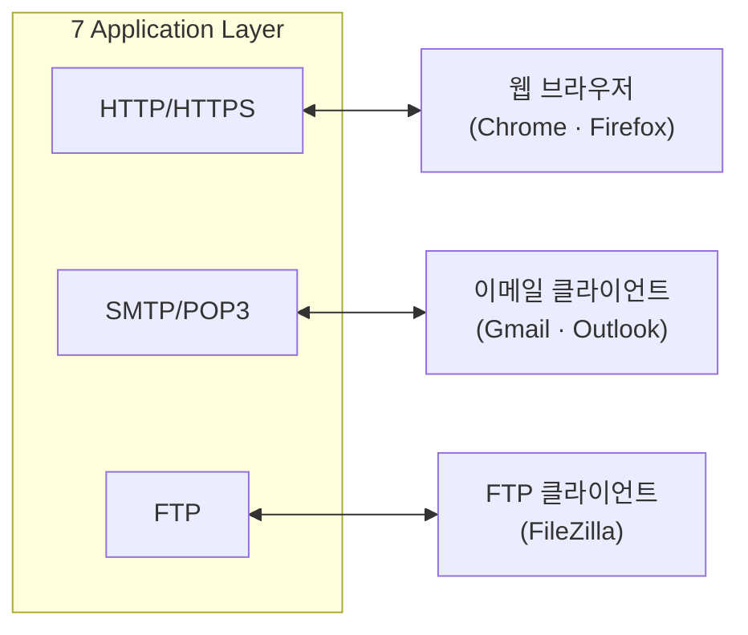
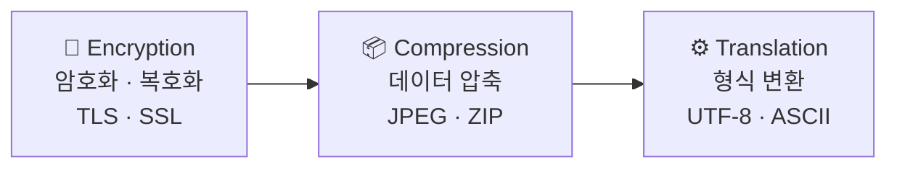
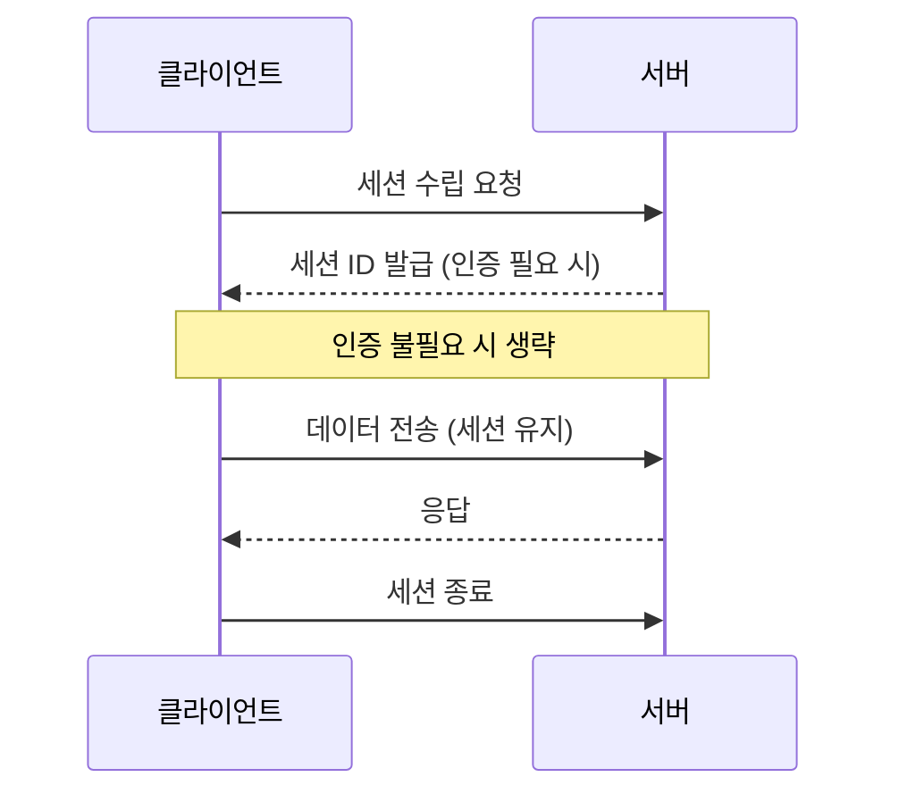
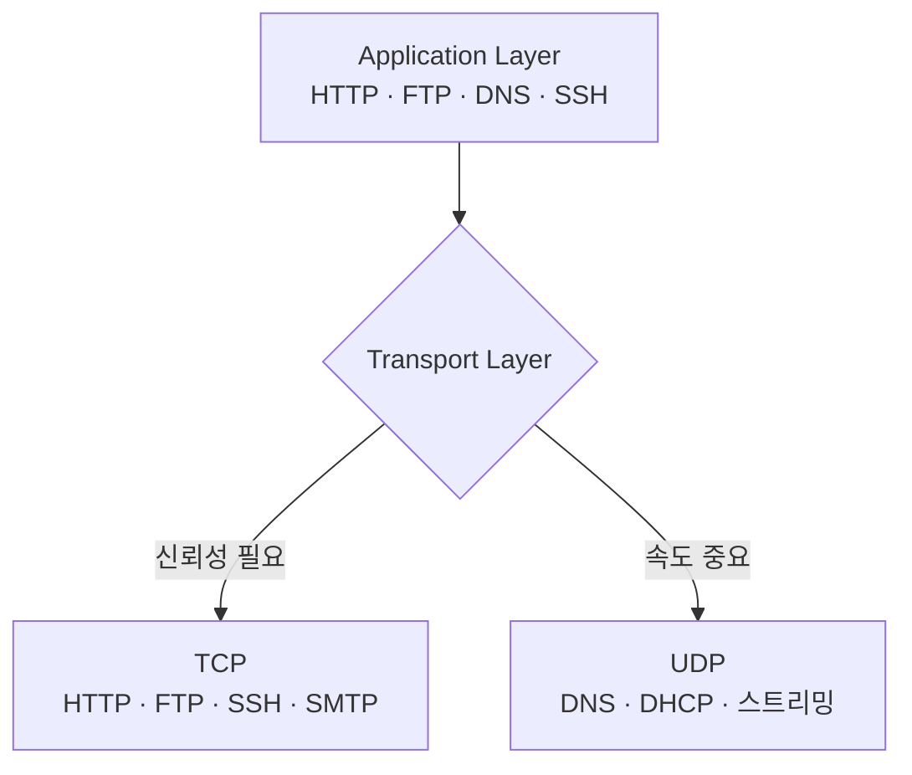
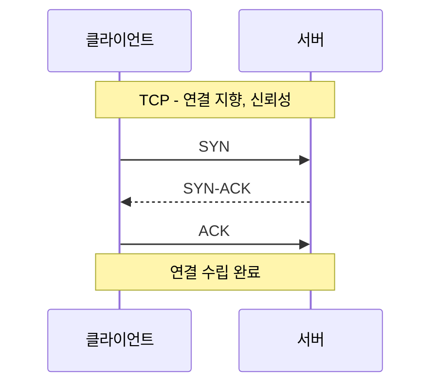
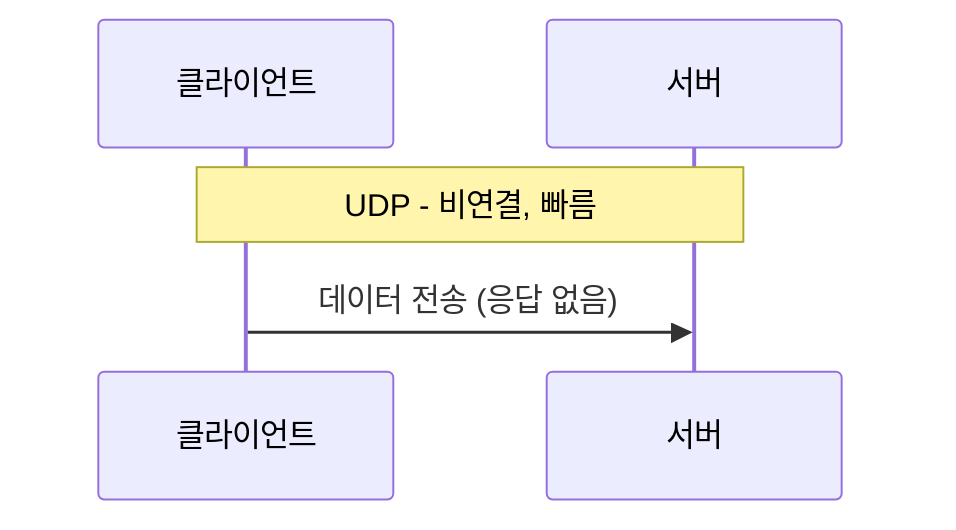
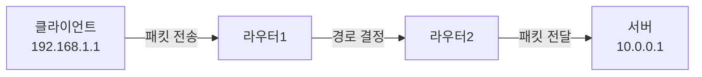
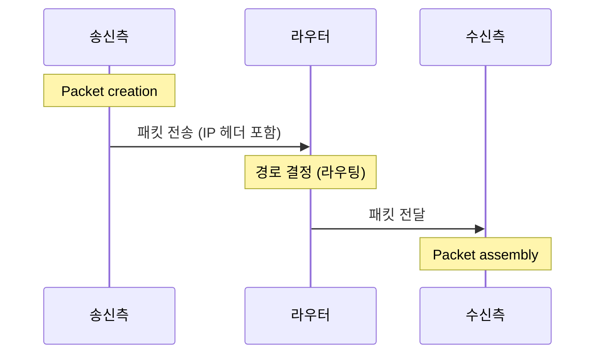
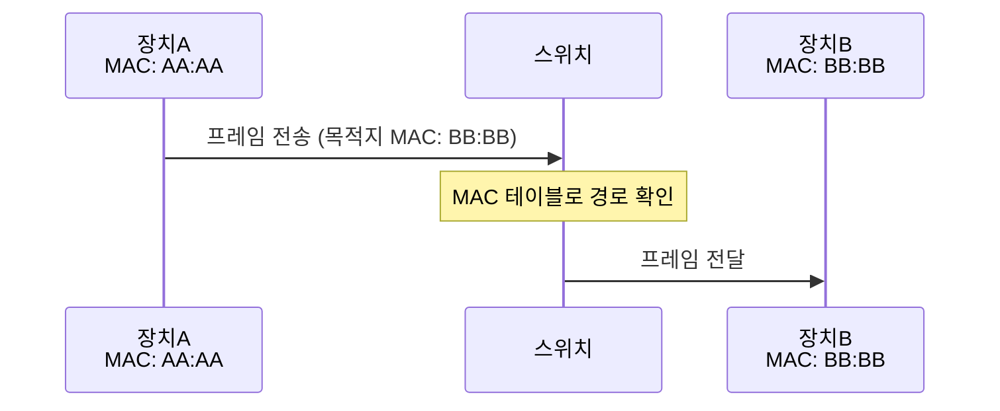
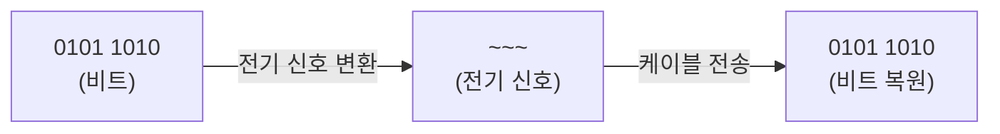

# What is Network?

# OSI 7 Layer

## What is OSI?
ISO: International Organization for Standardization (국제표준화기구)
- 1947년 설립된 설림된 비정부 조직 (NGO)
- 전 세계 160여개국 국가 표준 기관이 모여 만든 기구
- ISO는 그리스어 'isos', '동일하다'라는 뜻에서 유래함.
  - '아이소' 또는 '이소'라고 읽음.
OSI: Open System Interconnection (개방형 시스템 상호 연결)
- 상이한 컴퓨터 시스템이 서로 통신할 수 있는 표준을 제공합니다.
- 국제표준화기구에서 만든 개념 모델입니다.

## What is OSI Model?
OSI 모델이란 개방형 시스템 상호 연결(Open System Interconnection)로 국제표준화기구(ISO)에서 만든 모델입니다.

컴퓨터 네트워크의 범용 언어로 볼 수 있으며 통신 시스템을 7개의 계층으로 나누고 있습니다.

## OSI 7 Layer Table
| # | Layer | Protocols | PDU | 계층명 |
|:-:|-------|-----------|-----|--------|
| 7 | Application | HTTP / HTTPS · FTP · DNS · SSH · SMTP | Data | 응용 계층 |
| 6 | Presentation | TLS · JPEG · UTF-8 | Data | 표현 계층 |
| 5 | Session | NetBIOS · RPC | Data | 세션 계층 |
| 4 | Transport | TCP · UDP | Segment | 전송 계층 |
| 3 | Network | IP · ICMP · OSPF | Packet | 네트워크 계층 |
| 2 | Data Link | Ethernet · ARP | Frame | 데이터 링크 계층 |
| 1 | Physical | Cable · Wi-Fi · Hub | Bit | 물리 계층 |

### 7. 응용(Application) 계층
사용자의 데이터와 직접 상호작용하는 유일한 계층

HTTP:

HTTPS: 

FTP: 

DNS: 

SSH: 

SMTP: 

POP 3: 

| 프로토콜 | 포트 번호 | 용도 |
|---------|---------|-----|
| HTTP | 80 | 웹 |
| HTTPS | 443 | 보안 웹 |
| FTP | 21 | 파일 전송 |
| SSH | 22 | 원격 접속 |
| DNS | 53 | 도메인 조회 |
| SMTP | 25 | 이메일 발송 |
| POP3 | 110 | 이메일 수신 |

### 6. 표현(Presentation) 계층

### 5. 세션(Session) 계층

### 4. 전송(Transport) 계층

TCP - 3 Way Handshake

UDP

기타 프로토콜: SCTP, QUIC

### 3. 네트워크(Network) 계층

### 2. 데이터 링크(Data Link) 계층

### 1. 물리(Physical) 계층

# TCP/IP 4 Layer

| # | Layer | Protocols | PDU | 계층명 |
|:-:|-------|-----------|-----|--------|
| 4 | Application | HTTP · FTP · DNS · SSH · SMTP | Data | 응용 계층 |
| 3 | Transport | TCP · UDP | Segment / Datagram | 전송 계층 |
| 2 | Internet | IP · ICMP · ARP · OSPF | Packet | 인터넷 계층 |
| 1 | Network Access | Ethernet · Wi-Fi · PPP | Frame / Bit | 네트워크 접근 계층 |

# OSI 7 Layer vs. TCP/IP 4Layer
| OSI 7계층 | 프로토콜 | PDU | TCP/IP 4계층 |
|---------|---------|-----|------------|
| 7 Application (응용) | HTTP · FTP · DNS · SSH · SMTP | Data | Application |
| 6 Presentation (표현) | SSL/TLS · JPEG · ASCII | Data | Application |
| 5 Session (세션) | RPC · NetBIOS · SIP | Data | Application |
| 4 Transport (전송) | TCP · UDP | Segment | Transport |
| 3 Network (네트워크) | IP · ICMP · IGMP | Packet | Internet |
| 2 Data Link (데이터링크) | Ethernet · PPP · MAC | Frame | Network Access |
| 1 Physical (물리) | Cable · Hub · Repeater | Bit | Network Access |

# HTTP / HTTPS
## 1. HTTP 개념
## 2. HTTP의 통신 과정 (요청&응답)
## 3. HTTP의 요청 및 응답 메시지의 구조
## 4. 주요 HTTP 메서드 (요청 메시지의 차이점)
## 4.1. GET
## 4.2. POST
## 5. HTTPS의 통신과정
## 6. HTTP와  HTTPS의 차이점

# Reference
- CloudFlare.2026.03.13 Accessed."OSI 모댈아런?".cloudflare.(https://www.cloudflare.com/ko-kr/learning/ddos/glossary/open-systems-interconnection-model-osi/)[https://www.cloudflare.com/ko-kr/learning/ddos/glossary/open-systems-interconnection-model-osi/]
- 조남호.2019.07.17 Published."ISO는 '아이소'라고 읽어주세요!".samsung SDS.(https://www.samsungsds.com/kr/insights/1233835_4627.html)[https://www.samsungsds.com/kr/insights/1233835_4627.html]

